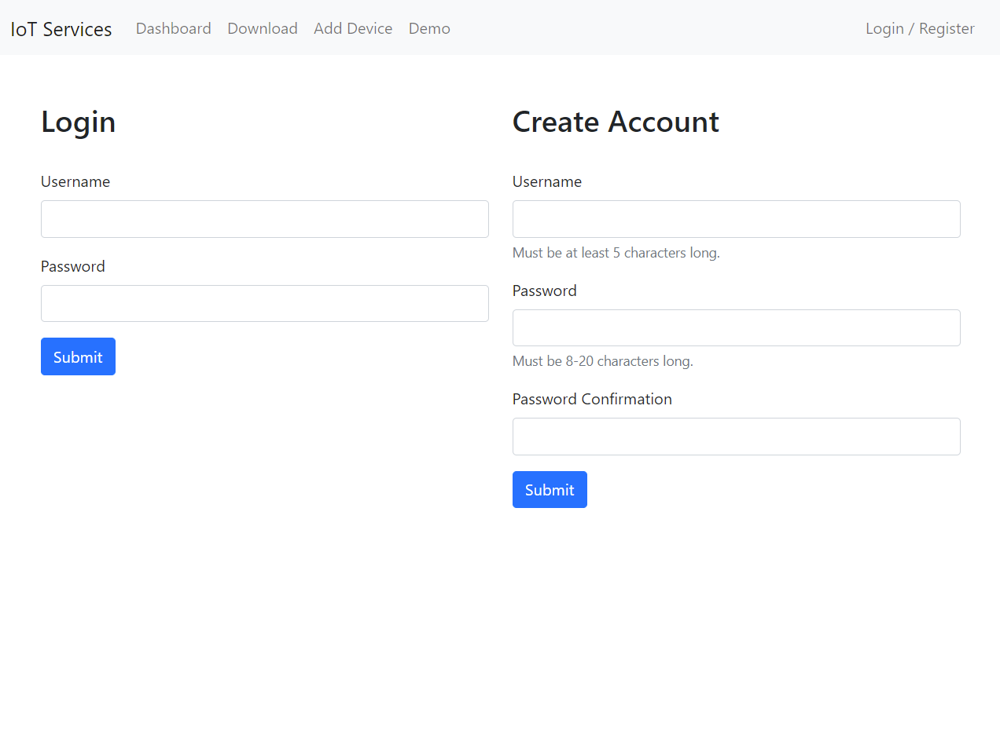

# Disclaimer

This is the demonstration repository of the project. The source code is private.

If you want access to it, please contact me at serrari.med@hotmail.com 

# IoT Server and client

This repo is a personal project where I developped a client-server architecture using flask as the main server and a REST api communication protocol.

For the the database I used SQLAlchemy which is an ORM (Object–relational mapping) that allows us to have a higher level of abstraction when writing database requests.

A special effort was made to secure the communications between the client and the server using multiple types of tokens.

## Token types:

* Access Token: used only by a user (valid for 30 minutes)
* Refresh Token: Used only by a user (valid for 1 minute)
* Device Token: Used by IoT devices only and is valid until revoked by user

JWT and flask_httpauth were used to secure all the requests between (server <-> user) and (server <-> device)

In its current state, the server can handle multiple users and each user can have multiple devices.
Each device can upload realtime data captured used its sensors.

## Unit testing:

The current unit tests cover the following functionalities:

* Account creation
* Existing acount verification
* Wrong password

* Add multiple devices per user
* Upload data from each device
* Get all devices of a user
* Get all data from all user devices

* Revoke access to device

# Frontend:

### Login page

Login or create an account

## Create Device

The user can create a device on the website. Currently the only supported device type is an analog gauge. Using the API the user can create any device type.

## Dashboard

The Dashboard is a unified view where the user can access all the devices associated with his account.

The Dashboard allows the user to access and modify certain element concerning each device:

### Changing Device Name:

The user can change the device name directly from the dashboard. As you can see in the video below, When device name is valid a success alert is shown to the user. When the device name is the same i.e. the user did not edit the text, a warning is shown and the text field turns orange. When the user enters a name used by another device, an error message pops up. 

### Accessing Device Config:

Device config is a slide down menu containing details about each device.

### Accessing Device QR:

Device QR is an access code that allows the device to connect to server and send data via the API. This code is a secret should not be distributed to other users.

## Device Data Plots:

The data being sent by the device can be accessed by clicking on the open plots.

In this page, the data is plotted for each `sensor` that the device has more than one.

## Download all user data from all devices:

All the data sent by the devices belonging to the user can be downloaded in csv format.

The data sent by the devices can be either a value or a dict of values

## Realtime Live Plotting:

Realtime plotting is a feature currently being developped. However, a demo is available which replicates exactly the behavior between the frontend and backend. 

In this demo the user can change the refreshrate which will change the tie between each request to the server. The data plotted is a cosine function recieved from a separate thread running in the background.

## Small Screens:

For better UX small screen support has been added to the following pages

|Create Device|Dashboard|Demo|
|:-:|:-:|:-:|
||||

# AI on edge:

AI on edge is a feature in developpement. Initially it will contain a vision module that can be deployed on edge devices that can read data from analog or digital gauges.

This module will be deployable on a raspberry like device equiped with a camera and will allow us to read analog meters and gauges.

# Future:

Every user can add and connect as many devices as he wishes.
These devices can then either process the collected data on the edge or send a raw format that will be processed by the server.
The used can view all the devices output on a dashboard.

A notification system will alert the user if a certain gauge is reading values outside of user-defined boundaries.
